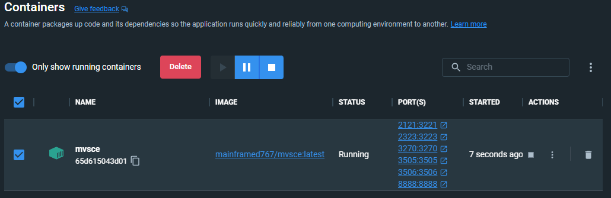
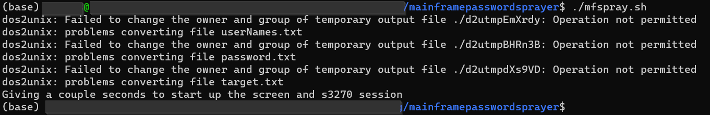
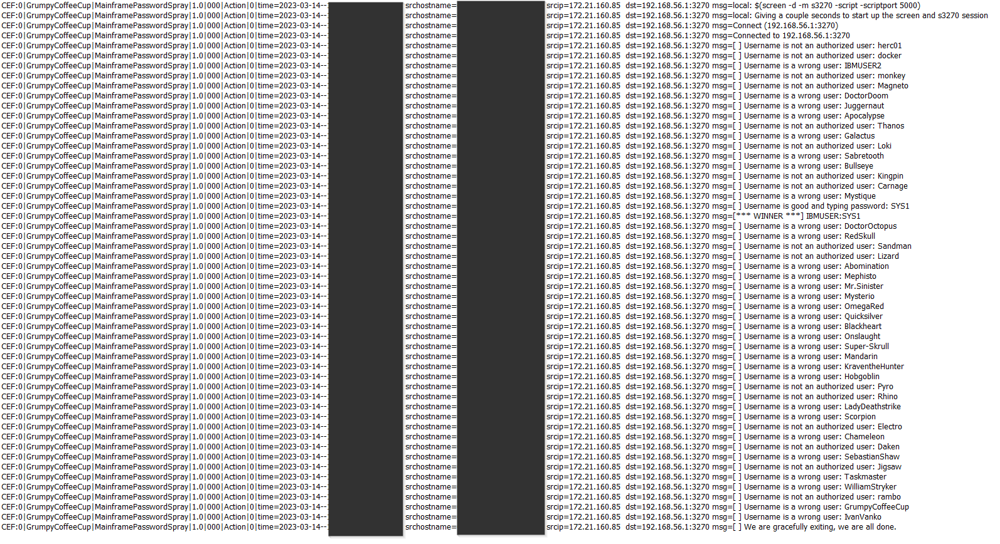
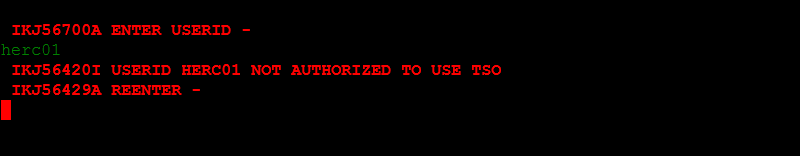
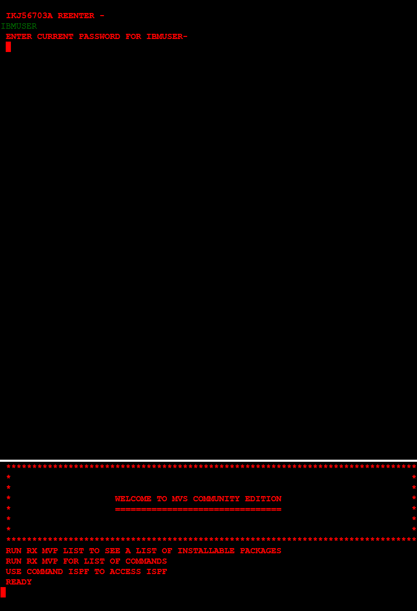

# Mainframe Password Sprayer

```
+-+-+-+-+-+-+-+-+-+ +-+-+-+-+-+-+-+-+ +-+-+-+-+-+
|M|a|i|n|f|r|a|m|e| |P|a|s|s|w|o|r|d| |S|p|r|a|y|
+-+-+-+-+-+-+-+-+-+ +-+-+-+-+-+-+-+-+ +-+-+-+-+-+
 by GrumpyCoffeeCup - MVSCE edition
```

## TLDR;

In light of concerns regarding Microsoft's use of Copilot, which has the potential to compromise the originality and privacy of my code, I have chosen to host my repository on an alternative platform. To access my work, please visit 

https://bitbucket.org/grumpycoffeecup/mainframepasswordsprayer/src/master/ 


Your support for secure and ethical code sharing practices is greatly appreciated.

This bash script allows you to use automatically do a password spray of a mainframe over the 3270 data stream protocol. (https://www.ibm.com/docs/en/zos-basic-skills?topic=enhanced-introduction-3270-terminal)

It will utilize x3270 package in the background (https://x3270.miraheze.org/wiki/X3270)
This implementation meant to be fast, so display output is minimal. A logfile is being appended during runtime, and will not stop if a valid login was found.

The logic is tailored for MVS CE, so it will not work for custom mainframe logic / screen - but it is possible to customize to your needs.

As always,

**DO NOT TEST PRODUCTION MAINFRAME**

See below for more disclaimer

## Educational Purposes Disclaimer

This project, including its materials, tools, and resources, is designed and provided for educational purposes only. The intent of the author is to facilitate learning, knowledge enhancement, and skill development. It is not to be used for any malicious, illegal, or unethical activities.

By using this project, you, the user, agree to utilize the information and resources provided within in a responsible manner and strictly for educational purposes. The user must be fully aware of the consequences and potential legal ramifications of misusing or repurposing the content for any activities that may cause harm, infringe upon the rights of others, or violate any laws or regulations.

The author has taken considerable effort to ensure the quality, accuracy, and reliability of the information provided. However, the author does not guarantee that the information is complete, up-to-date, or without errors. The author expressly disclaims any liability or responsibility for any inaccuracies or errors that may be present.

Under no circumstances will the author be held liable for any direct or indirect damages, losses, or consequences resulting from the use, misuse, or reliance upon the information provided in this project. By accessing and utilizing this project, the user agrees to indemnify and hold harmless the author from any claims, damages, or liability arising from their use of the content provided.

Your use of this project signifies your understanding and acceptance of these terms and conditions. If you do not agree with these terms, please refrain from using this project and its associated materials.


## Requirements
* Bash
* dos2unix 
* screen 
* x3270
* s3270

sudo apt install dos2unix screen x3270 s3270


## How to use this thing
1. Grab a copy of https://github.com/MVS-sysgen/docker-mvsce and run it according to the documentation


2. Change the IP "**target.txt**" and include the port number. My example is "192.168.56.1:3270"

3. (optional) Change the content of userNames.txt and/or password.txt

4. From Bash, run **./mfspray.sh**


5. (optional) Ignore the dos2unix errors if you are running this from WSL

6. Check out the generated **MFPasswordSpray_\<datestamp\>.log** and **test.html** files




